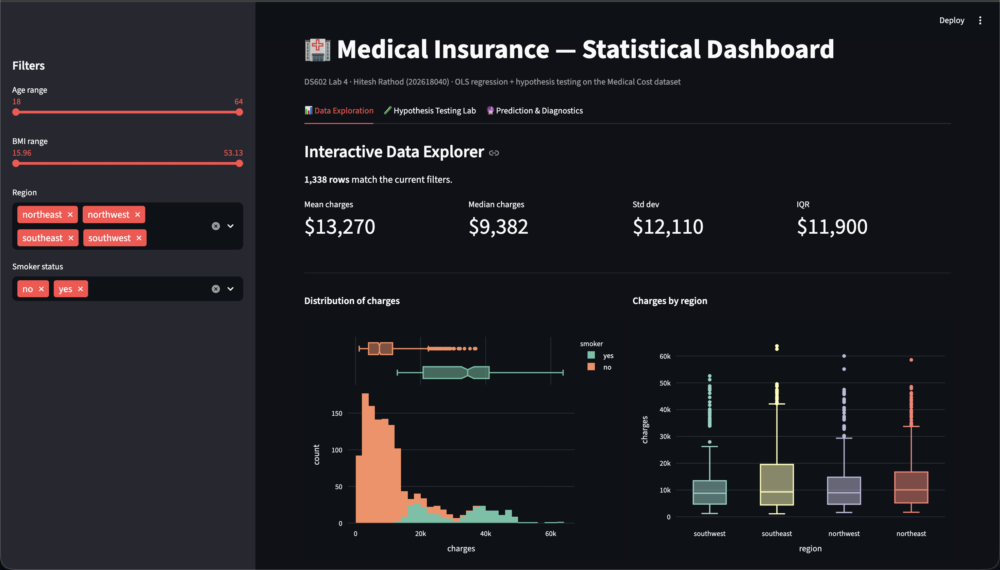
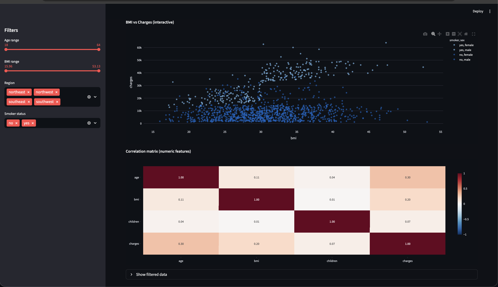
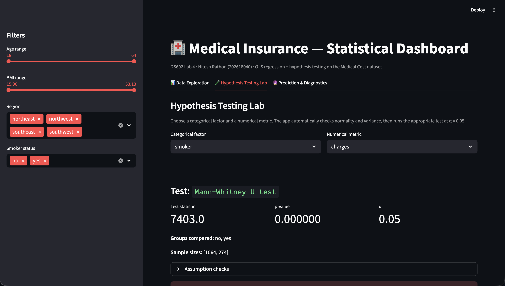
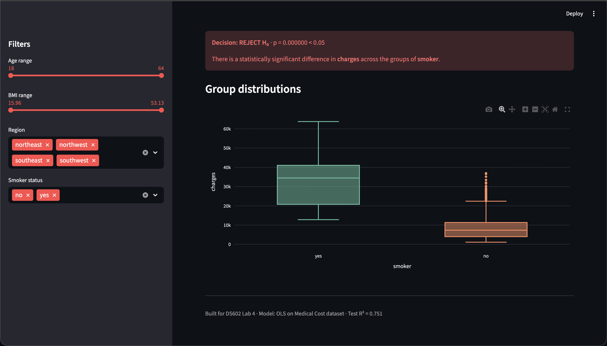
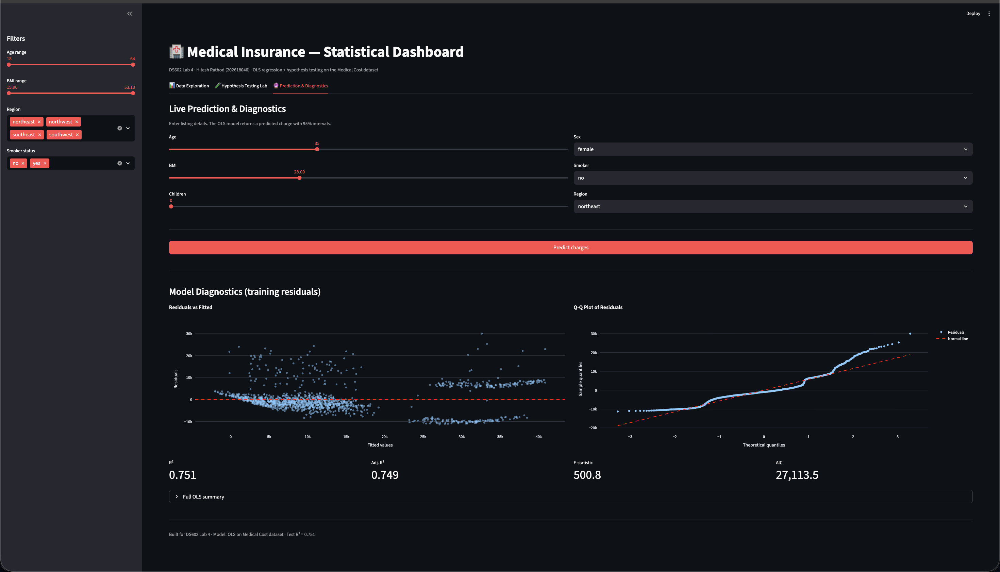

Medical Insurance - Statistical Analysis & Dashboard

DS602: Fundamentals of Data Science - Lab 4

Name: Hitesh Rathod
Roll Number: 202618040

An end-to-end statistical analysis of the Medical Cost Personal dataset
(1,338 records), covering exploratory data analysis, hypothesis testing,
OLS regression with Gauss-Markov diagnostics, and an interactive
Streamlit dashboard.

Live app: (will be added after deployment)

DATASET

Medical Cost Personal Dataset - 1,338 records, 7 columns

Columns:
- age: numeric, age of the beneficiary
- sex: categorical, female or male
- bmi: numeric, body mass index
- children: numeric, number of dependents
- smoker: categorical, yes or no
- region: categorical, northeast / northwest / southeast / southwest
- charges: numeric, medical charges (target)

Source: Kaggle - Medical Cost Personal Dataset

PART 1 - EDA AND HYPOTHESIS TESTING

Descriptive statistics:

Variable    Mean       Median     Std        IQR        Skew    Kurtosis
age         39.21      39.00      14.05      24.00      0.06    -1.25
bmi         30.66      30.40      6.10       8.40       0.28    -0.05
children    1.10       1.00       1.21       2.00       0.94    0.20
charges     13,270.42  9,382.03   12,110.01  11,899.63  1.52    1.61

Charges is heavily right-skewed (skew 1.52) and bimodal - the two peaks
correspond to smokers vs non-smokers.

Key visual findings:
- Charges distribution is bimodal; the higher peak corresponds to smokers.
- BMI is roughly normal around 30.
- Age has a spike at 18-19 (young adults) then spreads evenly.
- Smokers' mean charge ($32,050) is nearly 4x higher than non-smokers ($8,434).

Hypothesis Test 1 - Smokers vs Non-Smokers (charges)

H0: No difference in mean charges between smokers and non-smokers.
H1: Significant difference exists.

Assumption checks:
- Shapiro-Wilk: both groups p < 0.05, so not normal
- Levene: p < 0.05, so unequal variance

Test chosen: Mann-Whitney U (non-parametric, per the assignment's rule)

Result: U = 284,133, p is approximately 0. Reject H0.

There is a statistically significant difference in charges between the
two groups at alpha = 0.05.

Hypothesis Test 2 - Charges across 4 Regions

H0: Mean charges are equal across the 4 regions.
H1: At least one region differs.

Assumption checks:
- Shapiro-Wilk: all 4 groups p < 0.05, so not normal
- Levene: p < 0.05, so unequal variance

Test chosen: Kruskal-Wallis H (non-parametric counterpart to ANOVA)

Result: H = 4.7342, p = 0.192. Fail to reject H0.

Note on disagreement: The parametric One-Way ANOVA reports p = 0.031
(would reject), but since normality was violated in all groups, the
Kruskal-Wallis result is the reliable one. The ANOVA p-value is likely
inflated by the heavy skew of the charge distribution.

PART 2 - OLS REGRESSION & DIAGNOSTICS

Model:
charges = b0 + b1*age + b2*bmi + b3*children + b4*sex_male
        + b5*smoker_yes + sum(bj * region_j) + error

Baselines dropped: sex = female, smoker = no, region = northeast.

Overall fit:
R squared          0.751
Adjusted R squared 0.749
F-statistic        500.8
F p-value          < 0.001
Durbin-Watson      2.088

The model explains 75.1% of the variance in charges.

Significant coefficients at alpha = 0.05:
- smoker_yes: +$23,850, 95% CI [$22,993, $24,709], p < 0.001
- age: +$256.86, 95% CI [233.5, 280.2], p < 0.001
- bmi: +$339.19, 95% CI [283.1, 395.3], p < 0.001
- children: +$475.50, 95% CI [205.2, 745.8], p = 0.001
- region_southeast: -$1,035, 95% CI [-1,974, -96], p = 0.031
- region_southwest: -$960, 95% CI [-1,898, -22], p = 0.045

Not significant:
- sex_male: p = 0.693
- region_northwest: p = 0.459

Gauss-Markov diagnostics:
- Linearity: residuals vs fitted look roughly linear with some fan shape (OK)
- Homoscedasticity: Breusch-Pagan p < 0.001 (violated)
- Normality of residuals: Jarque-Bera 718.89, p < 0.001 (violated)
- Normality of residuals: Omnibus 300.37, p < 0.001 (violated)
- Multicollinearity: max VIF = 1.652 (OK)

Interpretation:
The two violations (heteroscedasticity, non-normal residuals) are typical
for medical cost data - right-skewed with heavy tails. OLS coefficient
estimates remain unbiased, but their standard errors may be slightly
optimistic. A log-transformed target or robust standard errors would be
the standard fix. The residuals plot also shows the model cannot capture
the smoker x bmi interaction, which is a known limitation of the additive
specification.

PART 3 - INTERACTIVE STREAMLIT DASHBOARD

The dashboard (LAB04/app/app.py) has three tabs:

Tab 1 - Data Exploration
- Sidebar filters: age range, BMI range, region multi-select, smoker status
- Reactive KPI cards (mean, median, std, IQR)
- Charge distribution histogram with smoker overlay
- Boxplot of charges by region
- Scatter of BMI vs charges, colored by smoker
- Correlation matrix heatmap

Tab 2 - Hypothesis Testing Lab
- Dropdowns to pick any categorical factor x any numerical metric
- Automatically runs Shapiro-Wilk + Levene
- Chooses the right test: Student's t / Welch's t / Mann-Whitney U /
  One-Way ANOVA / Kruskal-Wallis H
- Displays test statistic, p-value, and a clear
  Reject / Fail to Reject H0 banner
- Renders group distributions as a boxplot

Tab 3 - Live Prediction & Diagnostics
- Inputs: age, sex, BMI, children, smoker, region
- Live prediction via the saved OLS model
- 95% confidence interval (mean) and 95% prediction interval (individual)
- Residuals vs Fitted plot
- Q-Q plot of residuals
- Model KPI cards (R squared, Adj R squared, F-statistic, AIC)
- Expandable full OLS summary

PROJECT STRUCTURE

202618040_DS604/
  LAB04/
    app/
      app.py                      Streamlit dashboard
    data/
      insurance.csv               raw dataset
    docs/
      screenshots/                app screenshots
    models/
      insurance_ols.pkl           saved OLS model
    notebooks/
      stats_analysis.ipynb        full analysis notebook
    requirements.txt
  .gitignore
  .python-version
  requirements.txt                for Streamlit Cloud
  README.md

HOW TO RUN

1. Clone the repository
   git clone https://github.com/HiteshRathod77/202618040_DS604.git
   cd 202618040_DS604/LAB04

2. Set up the environment
   python -m venv venv
   source venv/bin/activate
   pip install -r requirements.txt

3. Launch the dashboard
   streamlit run app/app.py
   Open http://localhost:8501 in your browser.

4. Or open the notebook
   jupyter notebook notebooks/stats_analysis.ipynb

KEY TAKEAWAYS

1. Smoking is the strongest predictor of medical charges - nearly $24K
   higher on average, holding all else constant.
2. Age and BMI both contribute positively and significantly.
3. Region shows no reliable effect once the correct non-parametric test
   is applied.
4. The OLS model explains 75% of the variance in charges but violates the
   homoscedasticity and normality assumptions, which is worth flagging in
   any downstream use of the confidence intervals.

LIMITATIONS

- Dataset is from 2019 and US-only.
- No interaction terms were fit - the smoker x bmi interaction is visible
  in residuals but outside the scope of the required additive model.
- Prediction intervals assume the linear specification is correct.

AUTHOR

Hitesh Rathod - Roll No. 202618040
DS602: Fundamentals of Data Science - Lab 4

SCREENSHOTS

Tab 1 - Data Exploration (top half)

Tab 1 - Data Exploration (bottom half)

Tab 2 - Hypothesis Testing (top half)

Tab 2 - Hypothesis Testing (bottom half)

Tab 3 - Prediction and Diagnostics

